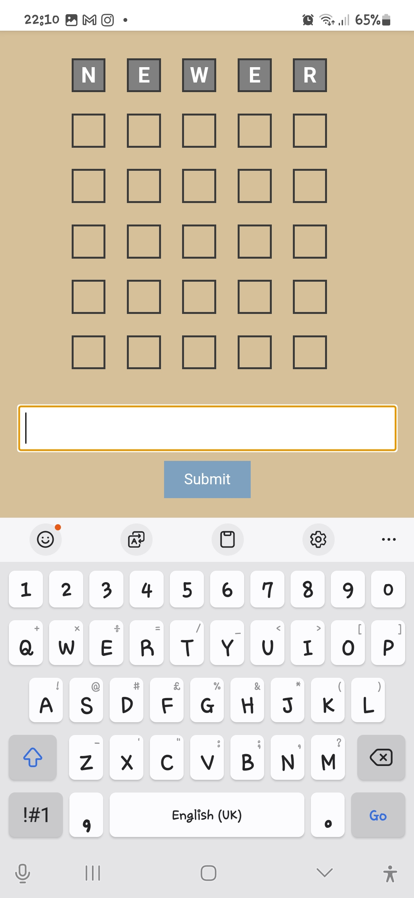
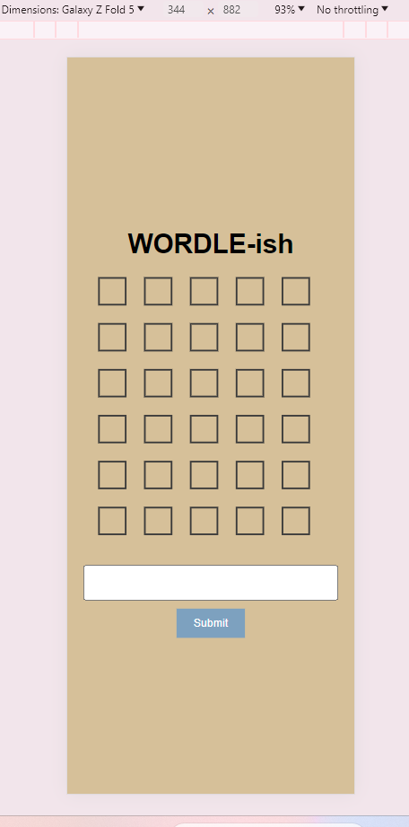

# WORDLES
As a lover of wordle I thought that being limited to only being able to play a new puzzle once a day was far too restrictive.  So I decided to make my own version so I and others could play away to our hearts content

Visit the deployed site: [WORDLES](https://maireadkelly.github.io/WORDLES/)

## Picture of the website in different devices
[Am I responsive image](/assets/images/am-i-responsive.png)

## User Experience (UX)

### User Stories

* As a user I want to be able to play as many games as I wish each day.
* As a user, I want to be able to play across a range of different devices.

### Testing user stories
**User Story 1**: As a user I want to be able to play as many games as I wish each day.
- Feature: With a word list of over 5750 words the only problem would be the battery life of your device.

**User Story 2**: As a user, I want to be able to play across a range of different devices.
- Feature: Game is user friendly over many devices.  The keyboard has been hidden on smaller devices to make for a much better user experience.

## Bugs

I ran my HTML and CSS code through the W3C Markup Validator - No Errors were found
I ran my Script.js through the JSHint validator and no errors were found.
However, during testing I found that playing on smaller screens was not very much fun as the on-screen keyboard was taking up too much screen space and really took the fun out of it. To resolve this problem I hid the on-screen keyboard for small devices.  This allowed for a much more enjoyable gameplay experience.

Another problem which took a lot of debugging to resolve was the instances of letters either
a) were in the guess more than once but only in the answer once eg. 
      guess was "There" and answer was "Apple" which caused the two instances of "e" being marked as "present" and "correct" respectively.
       To resolve this I had to write loop with corrsponding event listeners check all instances were correct.

   

### Functionality

* On-Screen Keyboard reflecting letters guessed

* Play Again Button

* Must be 5 letters long

### Accessibility

* The colors chosen are both easy for those who wish to play for long periods of time, but also take into account people who are color blind.

* I added a play again button instead of a timed refresh option to cater for those who use screen reader applications
alt text
* Use of Lighthouse to test accessability 

### Future Implementations

* Introduce statitistics tracker.
* The ability to recognise if a word guessed is in facct a real word.
* Add some fun features like sounds and animations. Such as fanfare for games Won and Oh No! for games lost.

### Languages Used

HTML, CSS, JavaScript

### Libraries & Programs Used

- [GitHub](https://github.com/) - Repository hosting and version control.
- [GitPod](https://www.gitpod.io/) - Integrated Development Environment (IDE).
- [Google Fonts](https://fonts.google.com/) - Importing fonts used in the game.
- [Favicon](https://favicon.io/) - Favicon as seen on the games online tab
- [Google Developer Tools](https://developer.chrome.com/docs/devtools/) - Testing and  troubleshooting.
- [Am I Responsive?](http://ami.responsivedesign.is/) - Responsive design visualization tool.
- - -

## Deployment
- Github pages
    - This project was deployed to GitHub Pages using the following steps
      - Log in to GitHub and locate the GitHub Repository
      - At the top of the Repository (not top of page), locate the "Settings" Button on 
        the menu.
      - Scroll down the Settings page until you locate the "GitHub Pages" Section.
      - Under "Source", click the dropdown called "None" and select "Master Branch".
      - The page will automatically refresh.
      - Scroll back down through the page to locate the now published site link in the "GitHub Pages" section.
      - live link for the page can be found here [WORDLES](https://maireadkelly.github.io/WORDLES/)
- Forking the GitHub Repository
    - By forking the GitHub Repository we make a copy of the original repository on our GitHub account to view and/or make changes without affecting the original repository by using the following steps
     - Log in to GitHub and locate the GitHub Repository
     - At the top of the Repository (not top of page) just above the "Settings" Button on the menu, locate the "Fork" Button.
     - You should now have a copy of the original repository in your GitHub account.
- Making a Local Clone
   - Log in to GitHub and locate the GitHub Repository
   - Under the repository name, click "Clone or download".
   -  To clone the repository using HTTPS, under "Clone with HTTPS", copy the link.
   - Open Git Bash
   - Change the current working directory to the location where you want the cloned directory to be made
   - Type git clone, and then paste the URL you copied in Step 3.
      - $ git clone https://github.com/YOUR-USERNAME/YOUR-REPOSITORY
   - Press Enter. Your local clone will be created.

- - -

## Testing
Different tests carried out were -
There were may different variables that needed to be tested to ensure that my version worked as close as possible to the Wordle I know and love, as I found out...the hard way

#1. 
Test that game can be used on computer, tablet and mobile devices.  As you will see the keyboard has been hidden on the moblie device to enable easy game play.

#2 Mobile device progression 

#3 Visual testing across moblie devices

Both HTML and CSS were validated using W3C validators, Javascript was tested using JSHINT ensuring compliance and correctness.

### Lighthouse

Lighthouse was used to test performance, accessibility, best practices, and SEO of the website.

### Browser Compatibility
Tested the website on different browsers to ensure compatibility:
- Google Chrome
- Mozilla Firefox
- Microsoft Edge
- Duck Duck Go

### Responsiveness
Screenshots of responsivness on different browsers.

[Duck Duck Go](<assets/images/duck test.png>)
All other screen shots were taken in Google chrome

- - -

## Credits

* Code Institute for project guidelines and reference. [Code Institute](https://codeinstitute.net/)
* GitHub for version control and repository hosting. [GitHub](https://github.com/)
* GitPod for providing their IDE for coding. [GitPod](https://www.gitpod.io/)
* Google Fonts for providing fonts used in the project. [Google Fonts](https://fonts.google.com/)
* MORGENSTERN2573 for the invaluable words.js file [MorgenStern2573](https://github.com/Morgenstern2573/wordle_clone)
* ChatGPT for helping me understand javascript so much better through helping me resolve the many problems encountered along the way [ChatGPT](https://chatgpt.com/)
* Font Awesome for my icons. [Font Awesome](https://fontawesome.com/)
* Palleton for helping me with colors and hex codes [Paletton](https://paletton.com/)

- - -

## Acknowledgments

Along with the above the help and support of my fellow class mates and Our tutor for their ongoing help and support through every twist and turn

